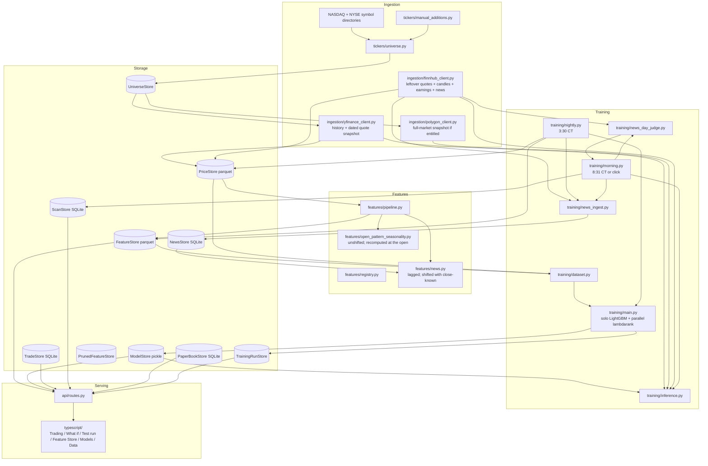

# stock-picker

Morning picks and trade history. ~2,000 US names, open→close, FastAPI + React.

Every morning:

- **Rank** — LightGBM lambdarank, top 20
- **Fit** — LightGBM return model, 0.5% gate

Nightly writes yesterday’s features. Morning plugs today’s open into the
open-known columns and scores Rank first, then Fit, then news on the short list.

A clone already has prices, features, and a trained model.

| What | Where |
|---|---|
| Prices / features / models | `data/{prices,features,models}/` |
| Trades | `data/trades/stockpicker.db` |
| Morning scans | `data/buy_signals/scans.db` |
| Paper book | `data/paper_book/paper_book.db` |

```
ingestion/ → storage/ → features/ → training/ → api/ → typescript/
```

## Architecture



## Quickstart

Bazel is pinned in `.bazelversion` (9.0.1). `brew install bazelisk`.

```
bazelisk build //...
bazelisk test //...
bazelisk run //python/stock_picker/api:main       # FastAPI :8000
bazelisk run //typescript:dev                     # Vite :5173, proxies /api
```

Phone (same Wi-Fi): `pnpm --dir typescript build`, start the API, Safari →
`http://<Mac-LAN-ip>:8000` → Add to Home Screen. App Store: `docs/app-store.md`.

Refresh after the close (or skip 3:30 CT):

```
bazelisk run //python/stock_picker/training:nightly
```

Log a trade

- Use the web form
- `bazelisk run //python/stock_picker/features:log_trade -- --ticker AAPL --side buy --shares 10 --price 230.00`

The API has no auto-reload. Restart `//python/stock_picker/api:main`. Vite hot-reloads.

After adding/removing a Python import: `bazelisk run //:gazelle`.

## Web app

- **Trading**
  - Run this morning’s inference
  - Rank and Fit lists (Last/Close when the scan is today)
  - Trade history with day / week / MTD aggregations
- **What if** — past morning lists, Open→Close
- **Test run** — fake opens, same scoring path, does not touch the live scan
- **Feature Store** — catalog, coverage, prune
- **Models** — pick families, run training, history
- **Data** — OHLCV chart

## Training

- Label: same-day open→close return
- Splits: 10% of tickers held out. Read `training/dataset.py` before changing this module.
- Live scoring (`training/inference.py`): copy last night’s row and score today’s open
- Fit is solo LightGBM. Rank is a separate pickle, never blended. New families go through `training/tune_experiment.py`
- Full retrain after the close, not a patch
- Holdout is on the Models tab. 0.5% gate is Fit only. Rank scores are relative.

## Jobs

Mac awake, Chicago time. Click on Trading around 8:31 is the proven path.

| When | What |
|---|---|
| Weekdays 3:30 PM | Prices → features → retrain |
| Weekdays 8:31 AM | Backup score if the checkbox is on |
| Click on Trading | Rank + Fit now, unchecks 8:31 |

Do not log index funds (SPY).
