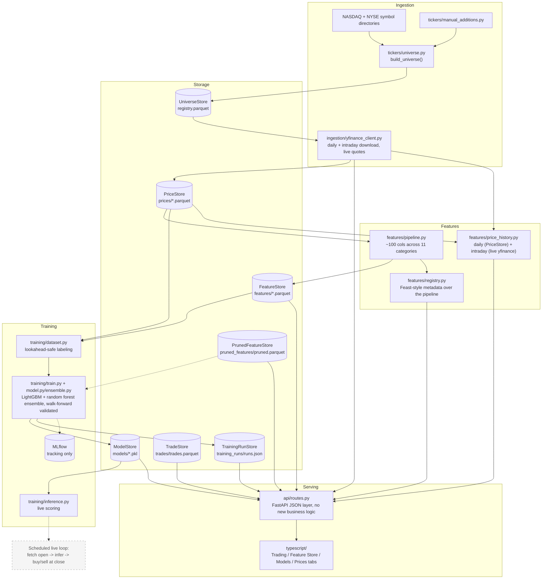

# stock-picker

- **Universe**: top 2000 US companies by market cap
- **Data**: daily OHLCV via `yfinance`
- **Features**: ~100 engineered columns across 11 categories
- **Model**: LightGBM + random-forest ensemble predicting day-session
  (open->close) return
- **App**: FastAPI + React, including a real trading log with live P&L

## Architecture

Solid boxes are built and tested; dashed boxes are planned but not built yet.



## Structure

```
python/stock_picker/
├── tickers/     # top-2000-by-market-cap universe
├── ingestion/   # yfinance: daily history, intraday bars, live quotes
├── storage/     # Parquet/pickle persistence (Repository pattern)
├── features/    # ~100-column pipeline, feature catalog, Feast-style registry,
│                #   trade log + P&L, feature pruning
├── training/    # LightGBM + random forest ensemble, walk-forward validated
└── api/         # FastAPI JSON layer -- every endpoint wraps a tested
                 #   pure function from features/, no new logic

typescript/      # React + Vite + TS frontend (Trading / Feature Store /
                 #   Models / Prices tabs)
```

## Quickstart

Bazel version is pinned in `.bazelversion` (9.0.1) -- install
[bazelisk](https://github.com/bazelbuild/bazelisk) (`brew install bazelisk`) rather than
plain `bazel` so it's picked up automatically.

```
bazel build //...
bazel test //...
bazel run //python/stock_picker/ingestion:main
bazel run //python/stock_picker/features:main
bazel run //python/stock_picker/training:main
bazel run //python/stock_picker/api:main    # FastAPI backend on :8000
bazel run //typescript:dev                  # Vite dev server on :5173, proxies /api -> :8000
bazel run //python/stock_picker/features:log_trade -- --ticker AAPL --side buy --shares 10 --price 230.00
```

Python BUILD.bazel files are gazelle-managed -- after adding/removing an import, run
`bazel run //:gazelle` to regenerate `srcs`/`deps` rather than hand-editing them. A few
deps that pandas/FastAPI need as implicit backends (no direct `import`) are marked
`# keep` so gazelle won't prune them; see the comment next to each for why.

Price/feature data lives in `data/{prices,features,universe,models}/` (all
gitignored). `bazel run //python/stock_picker/features:catalog` lists every
feature with a plain-English description and non-null coverage across the
universe -- useful for spotting a formula bug, not a judgment of "good"
vs. "bad" (a 120-day feature is just structurally ~52% covered with 1 year of
history; that's expected, not broken).

## Feature Store

`features/registry.py` describes the pipeline the way a real feature store
would ([Feast's vocabulary](https://docs.feast.dev/getting-started/components/registry):
Entity / FeatureView / FeatureService) -- metadata over the *existing*
pipeline, not a new backend. Browse it, the feature catalog, coverage, and
correlation/pruning all from the web app's Feature Store tab.

## Web app

FastAPI backend + React/Vite/TS frontend, both Bazel-integrated (`bazel test
//...` covers the whole stack).

- **Trading tab**: log buy/sell trades, live open/current prices via
  `yfinance`, and position-level P&L (average-cost basis; realized once
  closed, "if sold now" while open) grouped by day.
- **Feature Store tab**: registry (sortable by coverage/importance per
  feature) and a correlation heatmap with inline feature pruning -- pruned
  features are actually excluded from training, not just hidden in the UI.
- **Models tab**: a choosable ensemble (each model type shown with its
  package/version and a source link, via `training/model_registry.py`), a
  run-training control, and persisted Run History -- past runs' tickers,
  date range, features, and metrics, via `storage/training_run_store.py`.
- **Prices tab**: any ticker's OHLCV history, daily or hourly, as a line chart.
- Not yet done: production `vite build` wiring, frontend tests.

## Price history

Web app's Prices tab: type any ticker, toggle daily/hourly, see a close-price
line chart. `GET /api/prices/{ticker}?interval=daily|hourly`.

- Daily reads the already-ingested `PriceStore` -- only tickers in the
  tracked universe (a 404 for anything else).
- Hourly fetches live from `yfinance` for any real ticker, not persisted --
  `yfinance` retains hourly bars for ~730 days vs. ~7 for minute bars, so
  hourly is the practical default, and it's cheap to refetch on demand
  unlike the daily history features are trained on.

## Training

- Predicts the day-session (open->close) return, pooled across tickers (no
  per-ticker models).
- Validated with date-based walk-forward splits, plus a held-out set of
  entire tickers never seen in training.
- See `training/dataset.py` before touching anything else in this module --
  it's what prevents day t's own close from leaking into day t's features.
- **Setup**: 450 train tickers, 50 held out, 1 year of history, solo LightGBM
  (RandomForest, a small neural net, and Ridge regression were all tried as
  ensemble candidates via an empirical weight search -- see
  `training/tune_experiment.py` -- and none earned any weight blended with
  LightGBM; adding a model family isn't assumed to help, it's measured. The
  one time the weight search did pick a blend other than solo LightGBM, the
  resulting holdout accuracy dropped -- a validation-fold margin that didn't
  generalize, exactly the failure mode solo-LightGBM-as-floor guards against).
- **Reproducibility**: `LIGHTGBM_DEFAULT_PARAMS` enables random row/column
  subsampling (`feature_fraction`/`bagging_fraction`) -- without a fixed
  `seed`, two training runs on identical data produced holdout accuracy
  that differed by nearly a point, noise indistinguishable from a real
  config change. Fixed with `seed=0`; verified two runs now produce
  bit-identical predictions.
- **Base rate**: 50.17% of day-sessions close up with no model at all --
  near a coin flip, since the open->close return specifically (unlike
  multi-day returns) doesn't carry the market's long-run upward drift.
- **Walk-forward directional accuracy**: ~49-53% (a modest edge over the
  base rate, expected at this timescale).
- **Holdout accuracy**: 57.9% on 12,600 rows, reproducible run to run.
- **Threshold sweep on holdout** (gate on the model's *predicted* return,
  not a fixed dollar amount -- see `training/backtest.py`):

  | threshold | trades/year | hit rate | avg return |
  |---|---|---|---|
  | 0% (unfiltered) | 5,752 | 58.5% | +0.33% |
  | 0.5% | 399 | 81.2% | +1.48% |
  | 1.0% | 43 | 86.0% | +2.52% |

  Higher thresholds trade fewer, higher-conviction picks for a better hit
  rate -- not a free lunch, the tradeoff curve. 1.0%'s 43 trades/year is a
  small enough sample that any single number there is noisy.
- **Open, not-yet-adopted finding**: a ranking-objective LightGBM variant
  (rank each day's tickers against their same-day peers instead of
  predicting raw return magnitude) scores meaningfully better on Rank IC
  (0.0138 vs. 0.0034 for the regression objective) -- but its output is a
  same-day relative score, not a calibrated return, so using it would mean
  redesigning the trading-strategy layer from "trade when predicted return
  clears X%" to "trade the top-K ranked names." See
  `evaluate_ranking_objective()` in `tune_experiment.py`.

## Known issues

Real live inference (fetch today's open, score every ticker) surfaces
data-integrity gotchas.

**Guarded** -- `training/inference.py`'s `build_inference_row()` raises
rather than silently scoring on data that's more likely wrong than right:

- A stale feature snapshot -- `registry.check_freshness()` raises
  `StaleFeatureSnapshotError`.
- A stock split between ingestion and "now" producing a fake overnight gap
  that looks like a real signal -- `MAX_PLAUSIBLE_GAP` raises
  `ImplausibleGapError`.

**Still open** -- inherent to however a live caller ends up sourcing its
inputs (no live caller exists yet, see Roadmap's scheduled live scoring loop):

- Yahoo sometimes hasn't finalized yesterday's close when you pull (`NaN`
  row) -- can't assume "the last row is complete."
- A same-day pull can include today's own in-progress row, silently
  mislabeling it as "yesterday" via `.iloc[-1]`.

## Roadmap

- [ ] Holdout validation currently holds out entire tickers (never seen in
      training at all) -- consider a partial scheme for some tickers
      (fold in part of their history, hold out the rest) instead of an
      all-or-nothing split, to get more training signal without losing
      the "does this generalize to unseen stocks" check entirely
- [ ] Descriptive copy across the app needs a real editorial pass, not just
      spot-fixes when one goes stale
- [ ] No archived model binary per historical training run, only the latest
      (run metadata/metrics are all preserved -- `storage/training_run_store.py`)
- [ ] Clustering/unsupervised model families -- `model_registry.py` metadata
      is extensible, but `Ensemble`/`TrainedModel` still assume a continuous-
      return regression blend end to end (LightGBM, RandomForest, a small
      neural net, and Ridge are all wired in as real ensemble candidates)
- [ ] Additional ML features: multi-window volatility deltas (1d/3d/week-
      over-week/vs-10-days-ago)
- [ ] Ranking-objective LightGBM (rank each day's tickers against their
      same-day peers) scores meaningfully better on Rank IC than the
      regression objective -- built and measured (see
      `evaluate_ranking_objective()` in `tune_experiment.py`), not yet
      adopted: its output is a same-day relative score, not a calibrated
      return, so using it for real means redesigning the trading-strategy
      layer from a fixed-return threshold to a top-K-ranked selection
- [ ] Volatility-normalized (ATR-/realized-vol-scaled) confidence threshold
      instead of a fixed percentage -- built and measured (see
      `simulate_trades_vol_normalized()`/`evaluate_volatility_normalized_
      stability()`), showed a smaller hit-rate swing across the holdout
      window than the fixed threshold at a matched trade count, but not
      yet adopted as Buy Signal's actual gate
- [ ] Track how many feature/hyperparameter configurations have been tried
      against the same walk-forward split -- hold-out validation alone
      doesn't control for this, and with enough trials a backtest can look
      skilled while having none
- [ ] Validation slice within each walk-forward fold for early stopping
- [ ] Persist sector labels to unlock `sector_relative_return`
- [ ] DuckDB for ad hoc SQL over the Parquet lake
- [ ] Scheduled live scoring loop (fetch open -> infer -> buy/hold/sell)
- [ ] Production `vite build` + frontend tests
- [ ] Expansion beyond stocks on the same FTI core -- deliberately not
      generalized until there's a second real domain
