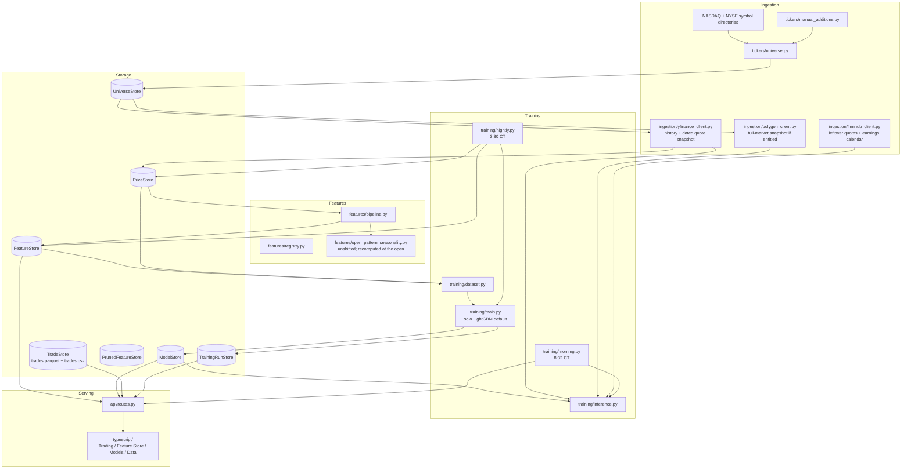

# stock-picker

Day-session (open→close) stock picker: ~2,000 US names, engineered features,
solo LightGBM by default, FastAPI + React, a real trade log with P&L.

- **Universe**: top 2,000 US companies by market cap
- **History**: daily OHLCV via yfinance, stored under `data/prices/`
- **This-morning opens**: Yahoo quote snapshot dated today, then 1-minute
  bars, then the daily chart. Polygon is first if the key is entitled
  (the free/Starter snapshot is not). Finnhub fills a small leftover set
  and supplies the earnings calendar skip.
- **Features**: ~135 columns across 12 categories, including 28 open-known
  recency patterns (last few completed days + this morning’s open)
- **Model**: LightGBM predicting day-session return. RandomForest, Ridge,
  and a small neural net are in the UI picker; none beat solo LightGBM on
  holdout in the last searches, so they are not in the default ensemble.
- **Jobs** (Mac must be awake): **3:30 PM Chicago** weekdays refresh
  prices, rebuild features through the last completed session, and fully
  retrain. **8:32 AM Chicago** weekdays score today’s opens into
  `data/buy_signals/`, writes `picks/YYYY/MM/DD.txt` + `picks/latest.txt`,
  and pushes that folder so it opens in the GitHub app. Email is optional
  and often stuck in local postfix. The Trading tab loads the JSON cache
  on click.

Price, feature, and model data is **tracked in git** so a fresh clone
already runs. Regenerating it rewrites large parquet blobs.

## Architecture



## Structure

```
python/stock_picker/
├── tickers/     # top-2000-by-market-cap universe
├── ingestion/   # yfinance history + live quotes; Polygon/Finnhub extras
├── storage/     # Parquet/pickle/CSV (Repository pattern)
├── features/    # pipeline, catalog, registry, trade log
├── training/    # dataset, models, ensemble, nightly/morning jobs
└── api/         # FastAPI -- endpoints wrap tested functions

typescript/      # React + Vite + TS (Trading / Feature Store / Models / Data)
```

## Quickstart

Bazel is pinned in `.bazelversion` (9.0.1). Install
[bazelisk](https://github.com/bazelbuild/bazelisk) (`brew install bazelisk`)
and invoke it as `bazelisk`.

```
bazelisk build //...
bazelisk test //...
bazelisk run //python/stock_picker/api:main       # FastAPI on :8000
bazelisk run //typescript:dev                     # Vite on :5173, proxies /api -> :8000
```

A clone already has prices, features, and a trained model. To refresh after
the close (or skip waiting for 3:30 CT):

```
bazelisk run //python/stock_picker/ingestion:refresh_prices
bazelisk run //python/stock_picker/features:main
bazelisk run //python/stock_picker/training:main
```

Log a fill (or use the Trading tab date/time form):

```
bazelisk run //python/stock_picker/features:log_trade -- --ticker AAPL --side buy --shares 10 --price 230.00
```

Python BUILD files are gazelle-managed: `bazelisk run //:gazelle` after
adding/removing an import. Implicit backends pandas/FastAPI need without a
direct `import` are marked `# keep`.

`bazelisk run //python/stock_picker/features:catalog` lists every feature
with description, formula, example, and coverage.

The API has **no auto-reload**. After changing Python under
`python/stock_picker/`, restart `//python/stock_picker/api:main`. Vite
hot-reloads on its own.

## Web app

- **Trading**: this-morning picks (saved 8:32 scan first; live rescore only
  if that file is missing), trade log with leftover-share lots, log-a-trade
  with date/time. Open lots vs closed lots by sell day. Fills also land in
  `data/trades/trades.csv`.
- **Feature Store**: registry, catalog, coverage/correlation (sampled),
  prune (actually excluded from training).
- **Models**: ensemble picker, run training, run history. Freshness on this
  tab and Trading: features and the live model must reach the last completed
  session or scoring is refused.
- **Data**: OHLCV chart, daily from PriceStore or hourly from yfinance.

## Training

Predicts the same-day open→close return, pooled across tickers. Walk-forward
on dates (never k-fold) plus a held-out set of entire tickers. Read
`training/dataset.py` before changing this module — most columns are
`shift(1)`’d; overnight gap and the open-known recency family are not,
because they use `Open_t` and never `Close_t`.

Default ensemble is solo LightGBM (`training/main.py`). Adding a family is
measured in `training/tune_experiment.py`, not assumed. LightGBM is fully
retrained after the close; it is not incrementally patched with two new days.

Holdout metrics change every retrain — see the Models tab / `data/training_runs/runs.json`.
The unfiltered day-session base rate is about a coin flip (~50%). A 0.5%
predicted-return gate trades fewer names for a higher hit rate
(`training/backtest.py`).

## Daily jobs

Launchd plists in `launchd/`, scripts in `scripts/`. Loaded on this machine
as `com.stockpicker.nightly` and `com.stockpicker.morning`.

| When | What |
|---|---|
| Weekdays 3:30 PM Chicago | Prices → features through last completed session → full retrain |
| Weekdays 8:32 AM Chicago | Score today’s dated opens → `data/buy_signals/` and `picks/YYYY/MM/DD.txt` (pushed) |

The Mac has to be on. Logs: `~/Library/Logs/stock-picker/`.

## Known issues

These are still true. The old README’s “no live caller exists yet” and
“same-day bar silently treated as yesterday” are **not** — live scoring
runs at 8:32 CT, and `ingestion/session.py` drops bars after the last
completed close before features/training see them.

**Still true**

- Thin names may not have an official open at 8:32. The morning job retries
  once a minute later if many quotes are missing; leftover names are skipped,
  not invented from last trade.
- Yahoo can still ship an unfinished daily bar *during* the session. The
  3:30 CT job runs after settle; a manual `features:main` at 10am would
  otherwise have included today’s in-progress candle (that’s what
  `completed_sessions()` is for).
- Yahoo can leave yesterday’s close as `NaN` if you pull before the daily
  bar is finalized. Nightly at 3:30 CT is usually past that; a too-early
  pull is still a vendor risk, not a silent `.iloc[-1]` bug.
- Polygon’s Default/Starter key 403s on the live snapshot — Yahoo is the
  real bulk open path until the key is entitled.
- `sector_relative_return` fills once Yahoo sectors are on UniverseStore
  (`bazelisk run //python/stock_picker/ingestion:fundamentals`; nightly
  fills a capped batch of missing names).

**Guarded (do not treat as open bugs)**

- Stale feature snapshot → `StaleFeatureSnapshotError` / freshness badge.
- Live open not dated today → ticker omitted from quotes.
- Large overnight gap → kept (a real print, not a 30% plausibility filter).

## Roadmap

Already shipped (do not re-open): nightly/morning jobs, leftover-share
lots, dated opens, open-known recency columns, `trades.csv`, per-run
archived pickles (`day_session_return_{run_id}.pkl`), volatility-delta
features.

- [ ] Ranking-objective LightGBM (better Rank IC; would mean top-K picks
      instead of a 0.5% return gate) — measured in `tune_experiment.py`
- [ ] Volatility-normalized confidence threshold — measured in
      `backtest.py`, not the live 0.5% gate
- [ ] Persist sector labels for `sector_relative_return`
- [ ] Bazel-wired production `vite build` + frontend tests (`package.json`
      has a build script; `typescript/BUILD.bazel` only runs `dev` /
      typecheck)
