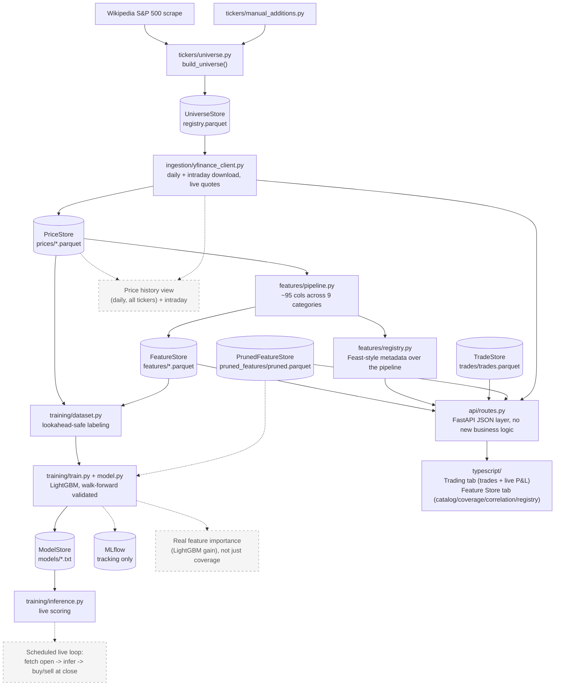

# stock-picker

Builds a universe of the top 500 US companies by market cap, pulls daily OHLCV
via `yfinance`, engineers ~95 features, trains a LightGBM day-session-return
model, and serves the whole thing through a FastAPI + React web app --
including a real trading log with live P&L.

## Architecture

Solid boxes are built and tested; dashed boxes are planned but not built yet.



## Structure

```
python/stock_picker/
├── tickers/     # top-500-by-market-cap universe
├── ingestion/   # yfinance: daily history, intraday bars, live quotes
├── storage/     # Parquet/LightGBM persistence (Repository pattern)
├── features/    # ~95-column pipeline, feature catalog, Feast-style registry,
│                #   trade log + P&L, feature pruning
├── training/    # LightGBM day-session model, walk-forward validated
└── api/         # FastAPI JSON layer -- every endpoint wraps a tested
                 #   pure function from features/, no new logic

typescript/      # React + Vite + TS frontend (Trading / Feature Store tabs)
```

## Quickstart

Bazel version is pinned in `.bazelversion` (9.0.1) -- install
[bazelisk](https://github.com/bazelbuild/bazelisk) (`brew install bazelisk`) rather than
plain `bazel` so it's picked up automatically.

```
bazel build //...
bazel test //...
bazel run //python/stock_picker/ingestion:main
bazel run //python/stock_picker/features:main
bazel run //python/stock_picker/training:main
bazel run //python/stock_picker/api:main    # FastAPI backend on :8000
bazel run //typescript:dev                  # Vite dev server on :5173, proxies /api -> :8000
bazel run //python/stock_picker/features:log_trade -- --ticker AAPL --side buy --shares 10 --price 230.00
```

Price/feature data lives in `data/{prices,features,universe,models}/` (all
gitignored). `bazel run //python/stock_picker/features:catalog` lists every
feature with a plain-English description and non-null coverage across the
universe -- useful for spotting a formula bug, not a judgment of "good"
vs. "bad" (a 120-day feature is just structurally ~52% covered with 1 year of
history; that's expected, not broken).

## Feature Store

`features/registry.py` describes the pipeline the way a real feature store
would ([Feast's vocabulary](https://docs.feast.dev/getting-started/components/registry):
Entity / FeatureView / FeatureService) -- metadata over the *existing*
pipeline, not a new backend. Browse it, the feature catalog, coverage, and
correlation/pruning all from the web app's Feature Store tab.

## Web app

FastAPI backend + React/Vite/TS frontend, both Bazel-integrated (`bazel test
//...` covers the whole stack).

- **Trading tab**: log buy/sell trades, live open/current prices via
  `yfinance`, and position-level P&L (average-cost basis; realized once
  closed, "if sold now" while open) grouped by day.
- **Feature Store tab**: registry, coverage, and a correlation heatmap with
  inline feature pruning -- pruned features are actually excluded from
  training, not just hidden in the UI.
- Not yet done: production `vite build` wiring, frontend tests.

## Price history *(in progress)*

- All tracked tickers' full daily price history, browsable by ticker.
- Intraday (hourly) granularity for recent sessions -- `yfinance` retains
  hourly bars for ~730 days vs. ~7 for minute bars, so hourly is the
  practical default; not persisted (cheap to refetch, unlike the daily
  history features are trained on).

## Training

Predicts the day-session (open->close) return, pooled across tickers (no
per-ticker models), validated with date-based walk-forward splits plus a
held-out set of entire tickers never seen in training. See
`training/dataset.py` before touching anything else in this module -- it's
what prevents day t's own close from leaking into day t's features.

**Current results** (450 train tickers, 50 held out, 1 year of history):
walk-forward directional accuracy is ~49-52% (coin-flip, expected at this
timescale); holdout accuracy is **56.0% on 12,500 rows**. At a 0.5%
predicted-return threshold, 186 trades clear it with a **73.1% hit rate**,
broad-based across 40 of the 50 holdout tickers (not propped up by a few
names -- excluding the top 5 tickers, hit rate *rises* to 78.6%).

## Known issues

Real live inference (fetch today's open, score every ticker) surfaced three
data-integrity gotchas, none yet handled structurally:

- Yahoo sometimes hasn't finalized yesterday's close when you pull (`NaN`
  row) -- can't assume "the last row is complete."
- A same-day pull can include today's own in-progress row, silently
  mislabeling it as "yesterday" via `.iloc[-1]`.
- A stock split between ingestion and "now" produces a fake overnight gap
  that looks like a real signal.

`registry.check_freshness()` exists to address the first two once wired into
`inference.py`'s live path (see Roadmap).

## Roadmap

- [ ] Wire `check_freshness()` into `inference.py`'s live path + a sanity
      bound on the overnight gap
- [ ] Real feature-importance metric before pruning, instead of coverage
      alone -- LightGBM gain and/or a simpler correlation-to-label score;
      show it next to each feature, and surface it in the prune UI too
- [ ] Clean up `Registry.tsx`'s feature-view header (`source: X · ttl: Yd ·
      owner: Z · N features`) -- reads as one messy inline string, want
      something more scannable (badges/chips)
- [ ] Show each feature's actual computation next to its description in the
      catalog -- code/SQL/plain-English formula, not just prose. The
      computation already lives in `features/*.py`; surface it rather than
      re-describing it
- [ ] Prune UX overhaul (`CorrelationHeatmap.tsx`'s "Top correlated pairs"
      cards): nicer styling, and a real destination for pruned features --
      an archive/pruned section showing *why* each was pruned (assume
      "high correlation to X" for anything pruned from the Correlation
      view). Extend `PrunedFeatureStore` (`storage/feature_exclusion_store.py`)
      with a `reason` field; switch it from Parquet to a plain JSON file --
      simplest thing that works for data this small, no sqlite/duckdb needed
- [ ] Price history view: daily (all tickers) + intraday
- [ ] Additional ML features: multi-window volatility deltas (1d/3d/week-
      over-week/vs-10-days-ago), gap-then-continuation (does a gap up/down
      tend to continue or reverse intraday)
- [ ] Validation slice within each walk-forward fold for early stopping
- [ ] Persist sector labels to unlock `sector_relative_return`
- [ ] DuckDB for ad hoc SQL over the Parquet lake
- [ ] Scheduled live scoring loop (fetch open -> infer -> buy/hold/sell)
- [x] ~~Web app (React + FastAPI)~~ -- done
- [x] ~~Feature pruning using correlation data~~ -- done
- [ ] Production `vite build` + frontend tests
- [ ] Expansion beyond stocks on the same FTI core -- deliberately not
      generalized until there's a second real domain
