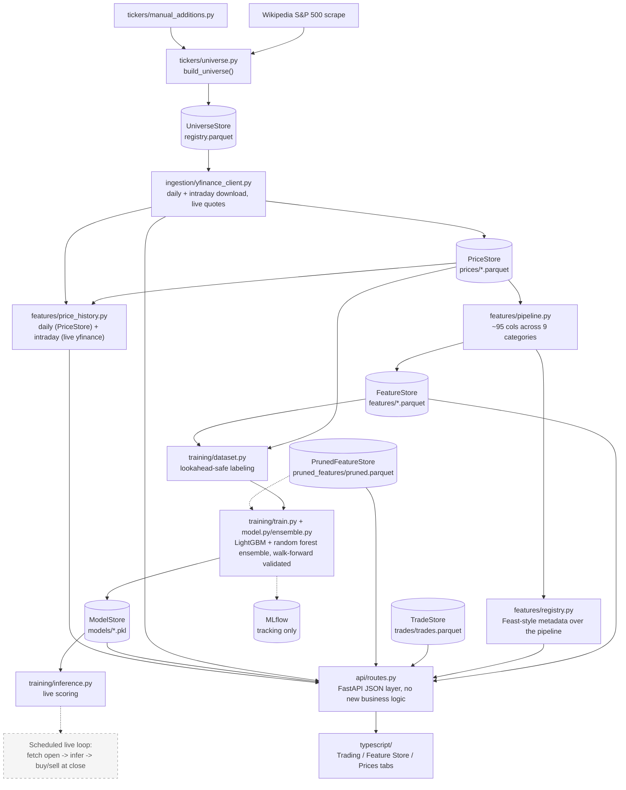

# stock-picker

Builds a universe of the top 500 US companies by market cap, pulls daily OHLCV
via `yfinance`, engineers ~95 features, trains an ensemble of models
(LightGBM + random forest) predicting day-session return, and serves the
whole thing through a FastAPI + React web app -- including a real trading log
with live P&L.

## Architecture

Solid boxes are built and tested; dashed boxes are planned but not built yet.



## Structure

```
python/stock_picker/
├── tickers/     # top-500-by-market-cap universe
├── ingestion/   # yfinance: daily history, intraday bars, live quotes
├── storage/     # Parquet/pickle persistence (Repository pattern)
├── features/    # ~95-column pipeline, feature catalog, Feast-style registry,
│                #   trade log + P&L, feature pruning
├── training/    # LightGBM + random forest ensemble, walk-forward validated
└── api/         # FastAPI JSON layer -- every endpoint wraps a tested
                 #   pure function from features/, no new logic

typescript/      # React + Vite + TS frontend (Trading / Feature Store tabs)
```

## Quickstart

Bazel version is pinned in `.bazelversion` (9.0.1) -- install
[bazelisk](https://github.com/bazelbuild/bazelisk) (`brew install bazelisk`) rather than
plain `bazel` so it's picked up automatically.

```
bazel build //...
bazel test //...
bazel run //python/stock_picker/ingestion:main
bazel run //python/stock_picker/features:main
bazel run //python/stock_picker/training:main
bazel run //python/stock_picker/api:main    # FastAPI backend on :8000
bazel run //typescript:dev                  # Vite dev server on :5173, proxies /api -> :8000
bazel run //python/stock_picker/features:log_trade -- --ticker AAPL --side buy --shares 10 --price 230.00
```

Python BUILD.bazel files are gazelle-managed -- after adding/removing an import, run
`bazel run //:gazelle` to regenerate `srcs`/`deps` rather than hand-editing them. A few
deps that pandas/FastAPI need as implicit backends (no direct `import`) are marked
`# keep` so gazelle won't prune them; see the comment next to each for why.

Price/feature data lives in `data/{prices,features,universe,models}/` (all
gitignored). `bazel run //python/stock_picker/features:catalog` lists every
feature with a plain-English description and non-null coverage across the
universe -- useful for spotting a formula bug, not a judgment of "good"
vs. "bad" (a 120-day feature is just structurally ~52% covered with 1 year of
history; that's expected, not broken).

## Feature Store

`features/registry.py` describes the pipeline the way a real feature store
would ([Feast's vocabulary](https://docs.feast.dev/getting-started/components/registry):
Entity / FeatureView / FeatureService) -- metadata over the *existing*
pipeline, not a new backend. Browse it, the feature catalog, coverage, and
correlation/pruning all from the web app's Feature Store tab.

## Web app

FastAPI backend + React/Vite/TS frontend, both Bazel-integrated (`bazel test
//...` covers the whole stack).

- **Trading tab**: log buy/sell trades, live open/current prices via
  `yfinance`, and position-level P&L (average-cost basis; realized once
  closed, "if sold now" while open) grouped by day.
- **Feature Store tab**: registry (sortable by coverage/importance per
  feature) and a correlation heatmap with inline feature pruning -- pruned
  features are actually excluded from training, not just hidden in the UI.
- **Prices tab**: any ticker's OHLCV history, daily or hourly, as a line chart.
- Not yet done: production `vite build` wiring, frontend tests.

## Price history

Web app's Prices tab: type any ticker, toggle daily/hourly, see a close-price
line chart. `GET /api/prices/{ticker}?interval=daily|hourly`.

- Daily reads the already-ingested `PriceStore` -- only tickers in the
  tracked universe (a 404 for anything else).
- Hourly fetches live from `yfinance` for any real ticker, not persisted --
  `yfinance` retains hourly bars for ~730 days vs. ~7 for minute bars, so
  hourly is the practical default, and it's cheap to refetch on demand
  unlike the daily history features are trained on.

## Training

Predicts the day-session (open->close) return, pooled across tickers (no
per-ticker models), validated with date-based walk-forward splits plus a
held-out set of entire tickers never seen in training. See
`training/dataset.py` before touching anything else in this module -- it's
what prevents day t's own close from leaking into day t's features.

**Current results** (450 train tickers, 50 held out, 1 year of history), now
from the 2-member LightGBM + random-forest ensemble: walk-forward directional
accuracy is ~48-53% (coin-flip, expected at this timescale); holdout accuracy
is **56.0% on 12,600 rows**. At a 0.5% predicted-return threshold, 100 trades
clear it with an **80.0% hit rate** (avg return 1.7% per trade); at 1.0%, only
3 trades clear it, too few to draw a conclusion from.

## Known issues

Real live inference (fetch today's open, score every ticker) surfaces
data-integrity gotchas. `training/inference.py`'s `build_inference_row()`
structurally guards two of them, raising rather than silently scoring on
data that's more likely wrong than right:

- A stale feature snapshot -- guarded via `registry.check_freshness()`,
  raises `StaleFeatureSnapshotError`.
- A stock split between ingestion and "now" producing a fake overnight gap
  that looks like a real signal -- guarded via `MAX_PLAUSIBLE_GAP`, raises
  `ImplausibleGapError`.

Still open, and inherent to however a live caller ends up sourcing its
inputs (no live caller exists yet -- see Roadmap's scheduled live scoring
loop):

- Yahoo sometimes hasn't finalized yesterday's close when you pull (`NaN`
  row) -- can't assume "the last row is complete."
- A same-day pull can include today's own in-progress row, silently
  mislabeling it as "yesterday" via `.iloc[-1]`.

## Roadmap

- [ ] Wire `check_freshness()` into live inference (staleness/overnight-gap
      checks)
- [ ] Registry: inline coverage/importance + sort control, revisit polish
- [ ] Registry visual polish -- still reads plain
- [ ] Prune UX: fold pruned status into Registry per-feature instead of a
      separate archive
- [ ] Modular model layer: LightGBM + random forest ensemble -- revisit
- [ ] Model-metadata endpoint/UI: show which models/features are in the
      ensemble
- [ ] Logistic-regression importance as a third lens (alongside LightGBM
      gain, RF impurity)
- [ ] Flag near-zero-importance features + one-click prune from Registry
- [ ] Pick which features feed a training run from the UI
- [ ] Show what a feature is correlated to directly on its Registry row (top
      N and/or over a threshold). Per-row correlations would actually cover
      *more* pairs than today's top-15 global list (a feature's own worst
      match doesn't have to crack the global top 15 to matter for that
      feature). Once that's in, revisit whether the separate Correlation tab
      is still pulling weight, or whether the canvas heatmap matrix
      specifically (not the ranked pairs list, which is the actually
      actionable part) can go -- the matrix mainly helps spot whole-universe
      correlation clusters at a glance, which per-row browsing doesn't
      replace, so don't drop it without confirming that's not needed
- [ ] Training run drill-down: which tickers and date range fed a given run,
      not just the holdout summary line. MLflow already logs per-fold
      metrics/params but not ticker/date provenance, and isn't surfaced in
      the app UI at all today (a separate `mlflow ui` process against
      `data/mlruns/mlflow.db`) -- decide whether to extend MLflow logging or
      just have the Training panel surface a run manifest directly
- [x] ~~Price history view: daily (any tracked ticker) + intraday~~ -- done
- [ ] Gap-then-continuation historically-conditioned feature -- tune bucket
      thresholds, validate against real (not just synthetic) data
- [ ] Additional ML features: multi-window volatility deltas (1d/3d/week-
      over-week/vs-10-days-ago)
- [ ] Validation slice within each walk-forward fold for early stopping
- [ ] Persist sector labels to unlock `sector_relative_return`
- [ ] DuckDB for ad hoc SQL over the Parquet lake
- [ ] Scheduled live scoring loop (fetch open -> infer -> buy/hold/sell)
- [x] ~~Web app (React + FastAPI)~~ -- done
- [x] ~~Feature pruning using correlation data~~ -- done
- [ ] Production `vite build` + frontend tests
- [ ] Expansion beyond stocks on the same FTI core -- deliberately not
      generalized until there's a second real domain
