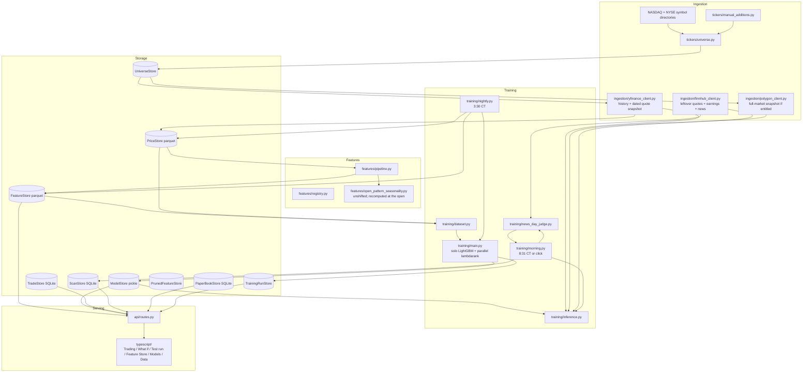

# stock-picker

Morning picks and trade history. ~2,000 US names, open→close (day session),
FastAPI + React.

Two lists every morning:

- **Rank** — LightGBM lambdarank, top 20, relative scores (not percents)
- **Fit** — LightGBM return model, names that clear a 0.5% predicted-return
  gate

Nightly writes yesterday’s features through the close. Morning plugs today’s
open into the ~30 open-known columns and scores. Rank publishes first, then
Fit, then news on the short list.

- **Universe**: top 2,000 US companies by market cap
- **History**: daily OHLCV via yfinance under `data/prices/`
- **This-morning opens**: Yahoo quote snapshot dated today, then 1-minute
  bars, then the daily chart. Polygon is first only if the key is entitled
  (Default/Starter 403s on the full-market snapshot; $199 real-time still
  does not guarantee 2,000 official opens at T+5s or T+30s). Finnhub fills
  a small leftover set and supplies the earnings calendar skip.
- **Features**: ~135 columns across 13 categories, including 28 open-known
  recency patterns (last few completed days + this morning’s open). Those
  columns are recomputed at the open; everything else stays last night’s
  snapshot.
- **Models**: default return ensemble is solo LightGBM. RandomForest, Ridge,
  and a small neural net are on the Models picker; none beat solo LightGBM
  on holdout, so they are not in the default blend. Lambdarank is a
  **parallel pickle** (`day_session_return_rank.pkl`), never averaged into
  the return blend.
- **Jobs** (Mac must be awake, `America/Chicago`): **3:30 PM** weekdays
  refresh prices, rebuild features, retrain. **8:31 AM** weekdays is the
  backup score. Prefer **Check this morning's prices** on Trading around
  8:31 — that click disables the 8:31 job for the day and takes a file lock so
  launchd cannot double-run.
- **News**: after Rank/Fit, Finnhub company-news on Fit + Rank 1–10, then
  Rank 11–20 and a second GitHub publish. Avoid only on big news (crash or
  mania), not any headline. Grok if a key is in the environment; otherwise
  TF-IDF + event phrases. Optional local Langfuse on `127.0.0.1:3100`.
- **Logs**: `print()` is gone. Jobs use `stock_picker.log.get_logger`.

Price, feature, and model data is **tracked in git** so a fresh clone
already runs. Regenerating it rewrites large parquet blobs. Trades, morning
scans, and the paper book are **SQLite** (`data/trades/stockpicker.db`,
`data/buy_signals/scans.db`, `data/paper_book/paper_book.db`).

## Architecture



Layers only talk downward:

```
ingestion/ → storage/ → features/ → training/ → api/ → typescript/
```

## Structure

```
python/stock_picker/
├── log.py       # get_logger(__name__); no print()
├── tickers/     # top-2000-by-market-cap universe
├── ingestion/   # yfinance history + live quotes; Polygon/Finnhub extras
├── storage/     # parquet prices/features; SQLite trades/scans/paper book
├── features/    # pipeline, catalog, registry, trade CLI
├── paper/       # Open→Close paper book over morning lists
├── training/    # dataset, models, ensemble, nightly/morning, news
└── api/         # FastAPI — endpoints wrap tested functions

typescript/      # React + Vite + TS
launchd/         # 3:30 CT nightly, 8:31 CT morning (backup)
scripts/         # morning.sh / nightly.sh
```

## Quickstart

Bazel is pinned in `.bazelversion` (9.0.1). Install
[bazelisk](https://github.com/bazelbuild/bazelisk) (`brew install bazelisk`)
and invoke it as `bazelisk`.

```
bazelisk build //...
bazelisk test //...
bazelisk run //python/stock_picker/api:main       # FastAPI on :8000 (LAN + loopback)
bazelisk run //typescript:dev                     # Vite on :5173, proxies /api -> :8000
```

iPhone Home Screen (same Wi-Fi, Mac awake, API running):

```
pnpm --dir typescript build
bazelisk run //python/stock_picker/api:main
```

On the phone, Safari → `http://<this-Mac-LAN-ip>:8000` → Share → **Add to Home Screen**. Not the App Store. Lid closed or off Wi-Fi = the icon does nothing.

App Store (other machine, personal cloud): see `docs/app-store.md`.

A clone already has prices, features, and a trained model. To refresh after
the close (or skip waiting for 3:30 CT):

```
bazelisk run //python/stock_picker/ingestion:refresh_prices
bazelisk run //python/stock_picker/features:main
bazelisk run //python/stock_picker/training:main
```

Log a fill (or use the Trading tab date/time form):

```
bazelisk run //python/stock_picker/features:log_trade -- --ticker AAPL --side buy --shares 10 --price 230.00
```

Python BUILD files are gazelle-managed: `bazelisk run //:gazelle` after
adding/removing an import. Implicit backends pandas/FastAPI need without a
direct `import` are marked `# keep`.

`bazelisk run //python/stock_picker/features:catalog` lists every feature
with description, formula, example, and coverage.

The API has **no auto-reload**. After changing Python under
`python/stock_picker/`, restart `//python/stock_picker/api:main`. Vite
hot-reloads on its own.

## Web app

- **Trading**: Rank and Fit from this morning’s scan. **Check this
  morning's prices** runs Rank+Fit now, unchecks 8:31, and waits if a scan
  is already running. Trade history is hold-to-close (8:40–2:55 CT via the
  daily bar), week groups, MTD / YTD / All. Fills live in SQLite; `trades.csv`
  is a dump. Do not log index funds (SPY) here.
- **What if**: every morning list Open→Close, Fit / Rank / top-K slices,
  hit rate, news Avoid on the short lists.
- **Test run**: fake opens only (last Close ±3%). Rank, Fit, or Both use
  the real morning path (`score_from_quotes`, `persist=False`) so Monday’s
  cache is not overwritten. Fake quotes are ~2s; scoring ~2,000 names is
  the slow part (~10 min) because each ticker rebuilds open-known columns
  from price history.
- **Feature Store**: registry, catalog, coverage/correlation (sampled),
  prune (actually excluded from training).
- **Models**: ensemble picker (return families + LightGBM Rank), run
  training, run history. Freshness: features and the live model must reach
  the last completed session or scoring is refused.
- **Data**: OHLCV chart, daily from PriceStore or hourly from yfinance.

## Training

Predicts the same-day open→close return, pooled across tickers. Walk-forward
on dates (never k-fold) plus a held-out set of entire tickers. Read
`training/dataset.py` before changing this module — most columns are
`shift(1)`’d; overnight gap and the open-known recency family are not,
because they use `Open_t` and never `Close_t`. Live scoring mirrors that in
`training/inference.py`: copy last night’s row, overwrite gap + the 28
open-known columns from today’s print.

Default ensemble is solo LightGBM (`training/main.py`). Lambdarank trains
alongside it when selected. Adding a return family is measured in
`training/tune_experiment.py`, not assumed. LightGBM is fully retrained
after the close; it is not incrementally patched with two new days.

Holdout metrics change every retrain — see the Models tab /
`data/training_runs/runs.json`. The unfiltered day-session base rate is
about a coin flip (~50%). A 0.5% predicted-return gate trades fewer names
for a higher hit rate (`training/backtest.py`). Rank scores are relative;
do not 0.5%-gate them.

## Daily jobs

Launchd plists in `launchd/`, scripts in `scripts/`. Loaded on this machine
as `com.stockpicker.nightly` and `com.stockpicker.morning`. Hours are Mac
local time (`CHICAGO_TIMEZONE = ZoneInfo("America/Chicago")` in
`ingestion/session.py`). Launchd does not catch up a missed calendar tick
(lid sleep).

| When | What |
|---|---|
| Weekdays 3:30 PM Chicago | Prices → features through last completed session → full retrain |
| Weekdays 8:31 AM Chicago | Backup: score today’s dated opens if the Trading checkbox is still on |
| Click on Trading ~8:31 | Disable 8:31, take `morning.lock`, Rank+Fit, news, publish |

Outputs: SQLite scan cache, `picks/YYYY/MM/DD.txt` + `picks/latest.txt`
(pushed so it opens in the GitHub app). Rank goes up as soon as Rank
finishes (target ~8:35). Fit + Rank 1–10 news on first publish; Rank 11–20
news republishes. Email is optional and often stuck in local postfix.

The Mac has to be on. Logs: `~/Library/Logs/stock-picker/` (stderr logging,
not `print`).

## Known issues

These are still true. Live scoring **does** run (click or 8:31 CT), and
`ingestion/session.py` drops bars after the last completed close before
features/training see them.

**Still true**

- Thin names may not have an official open at 8:31. Leftover names are
  skipped, not invented from last trade. Paying for Polygon real-time does
  not guarantee 2,000 official `day.o` prints at T+10s — NYSE DMMs finish
  the opening cross when they finish.
- Scoring ~2,000 names used to take ~10 min because Rank and Fit each
  rebuilt open-known rows. Rows are built once now (~2 min in Test run).
  Fake quotes are still cheap. Thin names may still miss the 8:31 open.
- Yahoo can still ship an unfinished daily bar *during* the session. The
  3:30 CT job runs after settle; a manual `features:main` at 10am would
  otherwise have included today’s in-progress candle (`completed_sessions()`).
- Yahoo can leave yesterday’s close as `NaN` if you pull before the daily
  bar is finalized. Nightly at 3:30 CT is usually past that.
- Polygon’s Default/Starter key 403s on the live snapshot — Yahoo is the
  real bulk open path until the key is entitled.
- `sector_relative_return` fills once Yahoo sectors are on UniverseStore
  (`bazelisk run //python/stock_picker/ingestion:fundamentals`; nightly
  fills a capped batch of missing names).
- 8:31 launchd has missed when the lid was closed or the weekday after a
  plist hour change had not fired yet. Click is the proven path.

**Guarded (do not treat as open bugs)**

- Stale feature snapshot → `StaleFeatureSnapshotError` / freshness badge.
- Live open not dated today → ticker omitted from quotes.
- Large overnight gap → kept (a real print, not a 30% plausibility filter).
- File lock → second 8:31 or second click skips with “already running”.

## Roadmap

Already shipped (do not re-open): nightly/morning jobs, leftover-share
lots, dated opens, open-known recency columns, SQLite trades/scans/paper
book, What if / Test run tabs, parallel Rank+Fit, lambdarank pickle, news
on the short list, click disables 8:31, stdlib logging.

- [ ] Volatility-normalized confidence threshold — measured in
      `backtest.py`, not the live 0.5% gate
- [ ] Persist sector labels for `sector_relative_return`
- [ ] Faster morning scoring (open-known recompute is the wall)
- [ ] Bazel-wired production `vite build` + frontend tests (`package.json`
      has a build script; `typescript/BUILD.bazel` only runs `dev` /
      typecheck)
