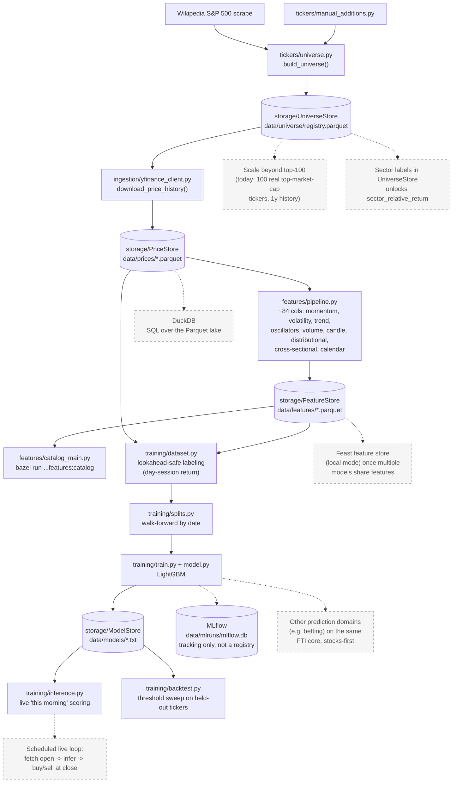

# stock-picker

Builds a universe of the top 500 US companies by market cap and pulls daily
OHLCV price history for each via `yfinance`.

## Architecture

Solid boxes are built and tested; dashed boxes are things we've discussed but not
built yet.



## Structure

```
python/
└── stock_picker/
    ├── tickers/     # top-500-by-market-cap universe + manual_additions.py
    ├── ingestion/   # yfinance pull -> raw OHLCV
    ├── storage/     # Parquet/LightGBM persistence (Repository pattern):
    │                 #   PriceStore, UniverseStore, FeatureStore, ModelStore
    ├── features/    # ~84-column feature pipeline (the "F" in FTI):
    │                 #   momentum, volatility, trend, oscillators, volume,
    │                 #   candle/gap shape, distributional, cross-sectional,
    │                 #   calendar -- see pipeline.py for the orchestrator,
    │                 #   catalog.py/catalog_main.py to browse what exists
    └── training/    # the "T"/"I" in FTI: LightGBM on the day-session
                      # (open->close) return, walk-forward validated,
                      # tracked in MLflow -- see dataset.py for the
                      # lookahead-bias fix, the single most important
                      # correctness property of this module
```

## Build / test / run

```
bazel build //...
bazel test //...
bazel run //python/stock_picker/ingestion:main
bazel run //python/stock_picker/features:main
bazel run //python/stock_picker/features:catalog
bazel run //python/stock_picker/training:main
```

Price history is written to `data/prices/<TICKER>.parquet` (gitignored).
Computed features are written to `data/features/<TICKER>.parquet` (gitignored),
one row per date, ~84 columns (see `python/stock_picker/features/pipeline.py`).
Run `bazel run //python/stock_picker/features:catalog` to list every feature by
category and see a non-null-coverage report across the current universe --
useful for spotting a formula bug (an unexpectedly all-NaN column) or just
seeing what a too-long window costs you in valid rows (the 120-day features
are ~52% covered with 1 year of history; the 60-day ones ~76%). Features
needing more trailing history than is available are left `NaN`, not dropped
or filled -- trimming/imputation is a training-time decision.

The cross-sectional `sector_relative_return` feature is defined but currently
always omitted: it needs a per-ticker sector label we don't persist yet
(would mean adding a `sector` column to `UniverseStore`, populated via one
`yfinance` `.info` call per newly-added ticker) -- a follow-up, not required
for `pipeline.py` itself.

Universe membership is tracked over time in `data/universe/registry.parquet`
(gitignored) via `UniverseStore`. Tracking is monotonic: the top-500 cutoff
only governs which new tickers get added on a given sync -- once a ticker
has ever qualified, it stays tracked even if it later falls out of the top
500. Add tickers outside the market-cap ranking via `MANUAL_ADDITIONS` in
`python/stock_picker/tickers/manual_additions.py`.

## Training

The model predicts the day-session (open->close) return -- buy at today's open, sell
at today's close. Trained pooled across tracked tickers (no per-ticker models, no
ticker-identity feature, to avoid memorizing per-ticker quirks with so little data),
validated with date-based walk-forward splits (never a random shuffle -- see
`training/splits.py`).

Read `training/dataset.py` before touching anything else in this module: it fixes the
lookahead bias that would otherwise leak day t's own close into the features used to
predict day t's return. `training/inference.py` reuses that exact same row-construction
logic for live "this morning" scoring, so training and serving can't drift apart.

Trained models persist via `ModelStore` (`data/models/<name>.txt`, LightGBM's native
format) -- that's what `inference.py` reads from. MLflow (`data/mlruns/mlflow.db`,
local SQLite backend, no server) is experiment tracking only, not the model registry.

`training/splits.py::select_holdout_tickers` deterministically holds out ~10% of the
active universe entirely (seeded random sample, not a hardcoded name list, so it stays
meaningful as the universe grows) -- walk-forward only proves the model generalizes
across *time* for tickers it has already seen; the holdout set tests whether it
generalizes to stocks it has never seen. `training/backtest.py` then simulates the
actual strategy against the holdout set: buy whenever the predicted return clears a
threshold, sell at the close, sweep several thresholds to see the
number-of-trades/hit-rate/return tradeoff.

With the real top-100-by-market-cap universe and a full year of history (~4,500 rows
per walk-forward fold, ~2,500 holdout rows across 10 unseen tickers), walk-forward and
holdout directional accuracy are both ~46-52% -- still coin-flip, as expected for a
first-pass model on an efficient market at this timescale. The threshold sweep shows a
real pattern worth watching rather than dismissing: hit rate rises with the threshold
(52% at 0%, 71% at 1%, based on 14 trades) -- more suggestive than the earlier 13-ticker
run's 2-trade fluke, but 14 trades is still not enough to call it a real edge (a fair
coin lands 10/14 or better about 9% of the time by chance alone). Read as a lead to
watch as the universe grows, not a conclusion.

## Roadmap

- Scale beyond the top-100 universe toward the full top-500 -- note that ranking cost
  (fetching market cap for the ~500-constituent candidate pool) doesn't shrink with a
  smaller final N, only the downstream ingestion/feature work does.
- Persist sector labels to unlock `sector_relative_return`.
- Month-level calendar seasonality -- skipped for now, ~21 same-month observations
  per ticker with 1 year of history isn't enough to be meaningful yet.
- Feature pruning once there's a real feature-importance signal to prune by --
  `momentum.py`'s simple/log return pairs and the three volatility estimator families
  are the likely-redundant candidates.
- A real feature store (Feast, local mode) once more than one model consumes the
  same features -- not needed yet at this scale.
- DuckDB for ad hoc SQL over the Parquet lake, if/when querying by hand outgrows
  reading individual Parquet files.
- A scheduled live scoring loop: fetch this morning's open, run `inference.py`,
  decide buy/hold/sell -- currently `inference.py` exists as a library, not a
  runnable service.
- Possible expansion beyond stocks (e.g. other prediction domains) on the same
  FTI core -- deliberately not generalized yet; extracting shared abstractions
  before there's a second real domain tends to guess wrong.
