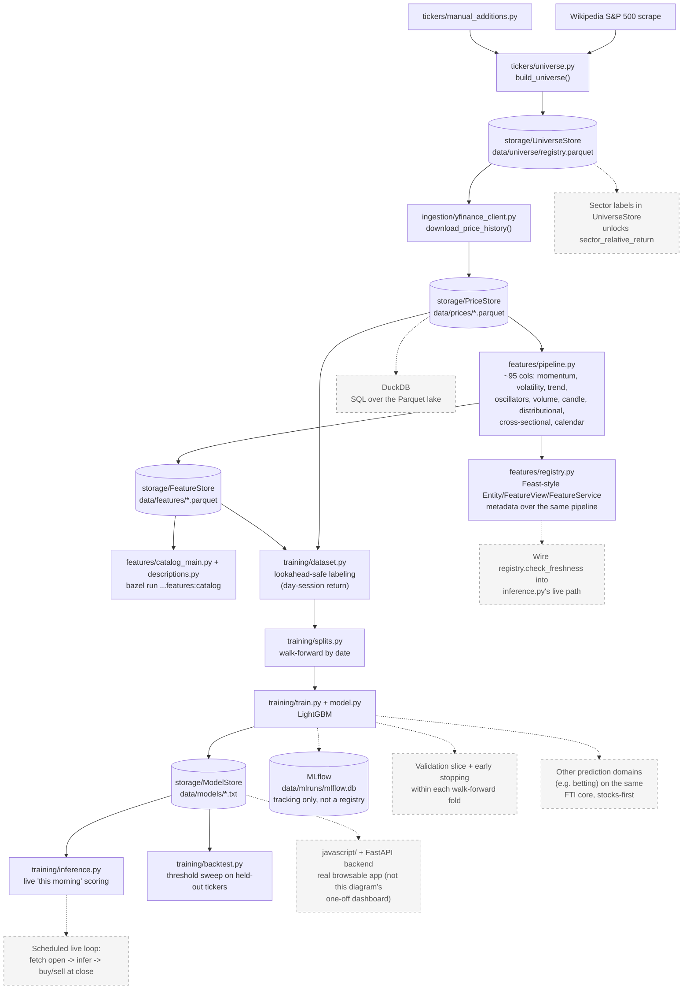

# stock-picker

Builds a universe of the top 500 US companies by market cap and pulls daily
OHLCV price history for each via `yfinance`.

## Architecture

Solid boxes are built and tested; dashed boxes are things we've discussed but not
built yet.



## Structure

```
python/
└── stock_picker/
    ├── tickers/     # top-500-by-market-cap universe + manual_additions.py
    ├── ingestion/   # yfinance pull -> raw OHLCV
    ├── storage/     # Parquet/LightGBM persistence (Repository pattern):
    │                 #   PriceStore, UniverseStore, FeatureStore, ModelStore
    ├── features/    # ~95-column feature pipeline (the "F" in FTI):
    │                 #   momentum, volatility, trend, oscillators, volume,
    │                 #   candle/gap shape, distributional, cross-sectional,
    │                 #   calendar -- see pipeline.py for the orchestrator,
    │                 #   catalog.py/catalog_main.py to browse what exists,
    │                 #   descriptions.py for plain-English explanations,
    │                 #   registry.py for Feast-style metadata (see Registry below)
    └── training/    # the "T"/"I" in FTI: LightGBM on the day-session
                      # (open->close) return, walk-forward validated,
                      # tracked in MLflow -- see dataset.py for the
                      # lookahead-bias fix, the single most important
                      # correctness property of this module
```

## Build / test / run

```
bazel build //...
bazel test //...
bazel run //python/stock_picker/ingestion:main
bazel run //python/stock_picker/features:main
bazel run //python/stock_picker/features:catalog
bazel run //python/stock_picker/training:main
```

Price history is written to `data/prices/<TICKER>.parquet` (gitignored).
Computed features are written to `data/features/<TICKER>.parquet` (gitignored),
one row per date, ~95 columns (see `python/stock_picker/features/pipeline.py`).
Run `bazel run //python/stock_picker/features:catalog` to list every feature by
category with a plain-English description (`descriptions.py`, pattern-matched by
column name so new windows are covered automatically) and a non-null-coverage
report across the current universe -- useful for spotting a formula bug
(an unexpectedly all-NaN column) or just seeing what a too-long window costs you
in valid rows (the 120-day features are ~52% covered with 1 year of history; the
60-day ones ~76%). Features needing more trailing history than is available are
left `NaN`, not dropped or filled -- trimming/imputation is a training-time
decision.

Not every category gets every window -- e.g. volatility/trend deliberately skip
1-3 day windows (a "3-day volatility" is mostly noise, and a 1-day SMA is just the
price itself), while momentum and RSI do get short windows because those are real,
distinct signals (momentum acceleration, RSI-2 mean-reversion) rather than
statistically degenerate ones.

The cross-sectional `sector_relative_return` feature is defined but currently
always omitted: it needs a per-ticker sector label we don't persist yet
(would mean adding a `sector` column to `UniverseStore`, populated via one
`yfinance` `.info` call per newly-added ticker) -- a follow-up, not required
for `pipeline.py` itself.

Universe membership is tracked over time in `data/universe/registry.parquet`
(gitignored) via `UniverseStore`. Tracking is monotonic: the top-500 cutoff
only governs which new tickers get added on a given sync -- once a ticker
has ever qualified, it stays tracked even if it later falls out of the top
500. Add tickers outside the market-cap ranking via `MANUAL_ADDITIONS` in
`python/stock_picker/tickers/manual_additions.py`. Ingestion tolerates a ticker
occasionally failing (delisting, a transient yfinance hiccup) -- `PriceStore`
just won't have that ticker for the run, and `features`/`training` skip it with
a warning rather than crashing the whole pipeline.

## Registry

`features/registry.py` describes the pipeline the way a real feature store's
registry would, modeled on [Feast's object vocabulary](https://docs.feast.dev/getting-started/components/registry)
(Entity / FeatureView / FeatureService) -- deliberately as metadata over the
*existing* pipeline rather than a new storage backend or a Feast dependency,
since we still only have one model consuming these features. `FeatureStore`
remains the actual values store; the registry just names and describes it:

- One **Entity** (`ticker`) -- the join key every feature view is keyed on.
- One **FeatureView** per category (`momentum`, `volatility`, ... -- derived
  from `catalog.list_feature_columns`, not hand-maintained), each with a
  `source`, `ttl_days`, `tags`, and `owner`.
- One **FeatureService** (`day_session_return_model`) naming which views today's
  one model consumes -- where a second model would plug in without restructuring.
- `check_freshness()`: is a feature snapshot within its view's `ttl_days` as of a
  given date. Not just structure -- see the live-inference lessons below for why
  this exists.

Browse it in the dashboard's Registry section alongside the existing feature
catalog.

## Live-inference lessons (2026-09-04)

Running real live inference for the first time (fetch today's open, score every
tracked ticker, rank by predicted return) surfaced three real data-integrity bugs
in one session, all now understood and worth remembering when touching this path:

1. **A finalized-yesterday assumption can be wrong.** Yahoo sometimes hasn't
   finalized the prior trading day's close yet when you pull -- the row exists
   with `NaN` Close. Re-pulling a day later fixed it, but a live tool can't
   assume "the last row is complete."
2. **"Today" can already be in the pulled data.** A same-day pull can include
   today's own in-progress row. Blindly taking `.iloc[-1]` as "yesterday" uses
   today's still-forming data mislabeled as the prior day -- a real off-by-one
   that would corrupt every lagged feature and the overnight gap.
3. **Stock splits desync historical vs. live data.** A ticker that splits
   between your last ingestion and "now" shows an enormous fake overnight gap
   (historical close pre-split vs. live quote post-split) that looks like a
   legitimate signal to the model. Caught by sanity-checking an implausible gap
   magnitude, not by any structural safeguard.

None of these are handled structurally yet -- `registry.check_freshness()` is
built to address (1) and (2) once wired into `training/inference.py`'s live path
(see Roadmap); (3) still needs a sanity bound or split-detection check.

## Training

The model predicts the day-session (open->close) return -- buy at today's open, sell
at today's close. Trained pooled across tracked tickers (no per-ticker models, no
ticker-identity feature, to avoid memorizing per-ticker quirks), validated with
date-based walk-forward splits (never a random shuffle -- see `training/splits.py`).

Read `training/dataset.py` before touching anything else in this module: it fixes the
lookahead bias that would otherwise leak day t's own close into the features used to
predict day t's return. `training/inference.py` reuses that exact same row-construction
logic for live "this morning" scoring, so training and serving can't drift apart.
Note: `inference.py` is a library today, not a runnable live service -- see Roadmap.

Trained models persist via `ModelStore` (`data/models/<name>.txt`, LightGBM's native
format) -- that's what `inference.py` reads from. MLflow (`data/mlruns/mlflow.db`,
local SQLite backend, no server) is experiment tracking only, not the model registry.

`training/splits.py::select_holdout_tickers` deterministically holds out ~10% of the
active universe entirely (seeded random sample, not a hardcoded name list, so it stays
meaningful as the universe grows) -- walk-forward only proves the model generalizes
across *time* for tickers it has already seen; the holdout set tests whether it
generalizes to stocks it has never seen. `training/backtest.py` then simulates the
actual strategy against the holdout set: buy whenever the predicted return clears a
threshold, sell at the close, sweep several thresholds to see the
number-of-trades/hit-rate/return tradeoff.

**Current results, real top-500-by-market-cap universe, 1 year of history** (450
train tickers, 50 held out): walk-forward (time-generalization) directional accuracy
is ~49-52%, still coin-flip -- expected on an efficient market at this timescale.
Holdout (unseen-ticker generalization) is **56.0% on 12,500 rows**, the first result
at a large enough sample to take seriously rather than dismiss as noise. The
threshold sweep is the more interesting piece: at a 0.5% predicted-return threshold,
186 trades clear it with a **73.1% hit rate** (vs. 56.8% at threshold 0, where every
day is traded).

**Concentration check (done)**: at 0.5%, 40 of the 50 holdout tickers contribute,
the top ticker is only 10% of trades, and excluding the top 5 tickers entirely
(40% of all trades) the hit rate *rises* to 78.6% -- broad-based, not propped up by
a few names. At the stricter 1% threshold (only 14 trades), the earlier problem
reappears: half the trades are one ticker, clustered into a few episodes. Trust the
0.5% number, not the flashier 1% one, at this data scale.

## Roadmap

- Wire `registry.check_freshness()` into `training/inference.py`'s live path, and
  add a sanity bound (or split-detection check) on the overnight gap -- the three
  live-inference lessons above, made structural instead of caught by eye.
- A validation slice within each walk-forward fold's training period (a trailing
  chronological chunk, not a flat % split) for LightGBM early stopping -- `model.py`'s
  `num_boost_round=100` is currently a fixed guess, not tuned against anything.
- Persist sector labels to unlock `sector_relative_return`.
- Month-level calendar seasonality -- skipped for now, ~21 same-month observations
  per ticker with 1 year of history isn't enough to be meaningful yet.
- Feature pruning using the correlation data already gathered -- `stochastic_k_14d`/
  `williams_r` are an exact affine duplicate (`%K = %R + 100`), and the return/
  log_return and Parkinson/Garman-Klass volatility pairs are ~99% correlated.
- DuckDB for ad hoc SQL over the Parquet lake, if/when querying by hand outgrows
  reading individual Parquet files.
- A scheduled live scoring loop: fetch this morning's open, run `inference.py`,
  decide buy/hold/sell.
- A real browsable app (React frontend + FastAPI backend exposing `storage/` as
  JSON) in a new top-level `javascript/` directory, alongside `python/` -- the root
  was organized by language from the start specifically to make this a sibling
  directory, not a restructure.
- Possible expansion beyond stocks (e.g. other prediction domains) on the same
  FTI core -- deliberately not generalized yet; extracting shared abstractions
  before there's a second real domain tends to guess wrong.
